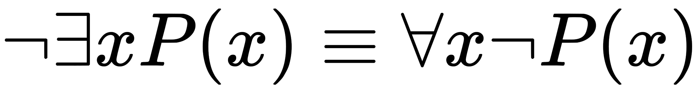

# Book 1: Being

## The Stage 

The selection of a title for this work has gone through several revisions:

- _Death_
- _The Phenomenology of Death_
- _The Ontology of Death_
- _Towards an Ontology of Death_
- _A Critique of Being_
- _The Death in Philosophy_
- _The Death of Philosophy_
- _The Philosopher's Suicide Note_
- _Solipsism and Inevitability_
- _Being Nothing Other Than Death_
- _The Misanthropy of Being_
- _The Misanthropy in Being_
- _The Horror of Death_
- _The Horror in Death_
- _Horror_
- _The Descent of Being_ 
- _The Twisting of the Screw_

Of these, the only one the author truly feels remorse for not selecting is the last. If the reader should find the current title lacking, perhaps they will find solace in this alternative, _The Twisting of the Screw_, as the author feels simply reading this is sufficient to understand the contents it encloses. 

The current title, _Being and Death_, is meant as an allusion to those monoliths of philosophy few people claim to have read and even less to have understood, e.g. _Being and Time_, _Being and Nothingness_, _Being and Event_, _Process and Reality_, etc. The author unfortunately counts himself among the former group, but lacks the hubris to claim membership to the latter. In this, there lurks the motivation for what the reader now finds in their hands. By putting his thoughts to paper, he sought to understand what it is these authors were getting at and in doing so believes he has found a problem lurking in their formulations. This work is an attempt to elaborate that problem. It should be clear, even at this early stage and without further exploration, what that problem is, in the estimation of the author.

Some of the titles not selected have been used as the headings of sections and subsections, indicating the scope of the current project outstripped the author's original intent. For that, he apologizes. If he knew at the beginning all of this would amount to so many countless words no one will ever read or understand (<sup><sub>the author being at the top of both lists</sub></sup>), he probably still would have written them, but done so with more evident despair and less gravitas. 

If the author is granted one contribution to the annals of philosophy, let it be the proof of the futility of all future philosophies. Forever after let us cast the would-be philosophers from great heights to end their miserable lives on the rocks below. If that be too ambitious, then let the contribution be atleast as a footnote affixed to everything that follows: "_Caution: you may die reading this_" 

In constructing such a proof, we shall adhere to the grand tradition of philosophy and arbitrarily capitalize some concepts and not others to denote their precise meaning in the following discourse, foremost among these: _Being_, _Nothing_, _Other_ and _Death_. We do this for no other reason but because, in the inimitable words of the twentieth century's greatest philsopher, **Bill Waterson**, we "_must obey the inscrutable exhortions of (the) soul_".

If the preceding lacks clarity, then let us rephrase more flippantly, in the hopes colloquialism will excite in the reader an appropriate vision of what is to come: _philosophy should tremble before the horror of Death as we do_. 

---


<sup style="margin-left: 5%;"><sub>- Bill Waterson, [March 13, 1995](https://www.gocomics.com/calvinandhobbes/1995/03/13)</sub></sup>

---

```
We shall not cease from exploration
And the end of all our exploring
Will be to arrive where we started
And know the place for the first time
```
<sup style="margin-left: 5%;" ><sub>- T.S. Eliot, [Little Gidding V](http://www.columbia.edu/itc/history/winter/w3206/edit/tseliotlittlegidding.html)</sub></sup>

---

## The Question

**Albert Camus** once stated there is but one philosophical question and that is suicide. In this, **Camus** skipped over much to arrive at his starting point. However, to his credit, he only meant it in the rhetorical sense, as way to examine the absurdity of living in a universe where you are fated from the very start to die at the end. Nevertheless, there is a definite proximity to primordial truth in his formulation of the so-called "_philosophical question_". 

The thesis of the present work can be summed up succinctly in the opening paragraphs, so that no one need read any further and may at once put these words to rest so as to never think on them again: Death is the bedrock at the bottom of Being; it precedes us in every way, before knowledge and language, before awareness of time and space, before the birth of our historical self. In order to be we must possess the ability to die, first and foremost. As such, we are condemned to die simply by Being. Whether we die in ignorance or with full awareness of our mortality matters not to Death, because Death is not something that _cares_[^1]. From this and because of this, all things proceed. 

This is what **Camus** got wrong: A Being cannot _be_ without the phantom of Death hounding its every step. Only in the subsequent development of self, once reflective consciousness[^2] enters into the equation, do we ask whether or not a life always imperilled is worth living.

Despite being the foundation of almost every human pathology, Death as a field of inquiry has received comparatively little analysis over the course of history, except in the medical sciences where it is treated clinically, to be catalogued and diagnosed along with all the other maladies and diseases and thus placed into a knowable relation with the rest of Being, or in the spiritual studies, where it is mythologized and understood only through metaphor, never as an experience that happens _to_ us.

There is a reason for this: Death as a subject is repellant to individual understanding. Its very definition presupposes the limit of the knower; That is to say, Death is inherently unknowable. Death can only be understood through the mechanisms of analogy and metaphor, via the circuituous and torturous route of symbolism, for when we turn our attention directly to the object of Death it reveals itself as something which can not be found in Being. 

We can be aware that we will eventually die, we can perceive others passing from this world, we can even in unique circumstances perceive the manner of our own Death, but none of this gets us any closer to the experience of Death, what it is like to die. Our experience and awareness of experience will never be extended into Death itself. Death is the point where experience and awareness stops, if by the conjunction of terms, experience and awareness, we mean `Being-in-the-world` (<sup><sub>see [below](#being)</sub></sup>), i.e. **Heidegger**'s `Dasein`. 

In this way, we mean Death exists beyond the limit of understanding; to make the relationship thus denoted more clear, we might coin the term `understanding-of-the-world`[^3], and posit Death as that which removes this from Being, and thus annihiliates Being. We see, as a result of the unknowability of Death, how the ontological necessity between Being and knowledge emerges. The provisional aim of this work is to show this unknowability metaphysically precedes and constrains Being, and that furthermore this constraint imposes upon Being an ontological character. Death, in the unknowability of its Nothingness, illuminates Being. 

Death then, while unapproachable, becomes a way to understand our own Being, for it shows us the domain of the problem, the problem being what it means _to be_ in the world. Death is `a priori` to Being, baked into all ontologies, even if they do not explicitly acknowledge it as such. _To be_ inherently contains the possibility of _not Being_. The `invariance` of Death is a fundamental constant of nature and thus provides a universal metric by which to [unpack existence into representative form](./02_death.md#death-as-not-object). 

To ask questions about a subject that perpetually recedes from all attempts to know it necessarily entails the admission up front that no answers can ever be conceived, much less perceived. The inevitable end result will be to arrive where we started, back in the here and now, having gained Nothing, except perhaps an understanding of what it means to be futile, which will anyway evaporate when we die; If any proposition can lay claim to human nature, this is it. 

It would seem, then, it does not matter which direction we choose to go, since we will always return to our starting point, no better or worse for having made the circuit. For this reason, the author recommends no one should read what follows. Instead, the reader is advised that going outside is by far a better course of action.

[^1]: As if often the case when playing the exisentialist language game, we adopt the **Heideggerian** sense of the word _care_, or _concern_, i.e. the way in which a Being orients itself in the world, or the manner in which we, as Beings, are drawn into the world, so that we might engage with it through action. 

[^2]: `reflective consciousness` as opposed to `ontical consciousness`; i.e. the consciousness of being conscious versus being conscious. This is what **Heidegger** called the split between _ontology_ and _onticity_. According to **Heidegger**, the human is a `factical` implementation of the `Dasein`, a type of Being that is concerned with its Being. All of these terms will hopefully be clarified over the course of what is to come.

[^3]: We add here the caveat the terminology so far introduced is not yet a complete and exhaustive description of the ontological relations being examined. Throughout the course of the present, we will attempt to elucidate what it means _to be_ in relation to Death; this neologism is the first of many we will formulate, as the primary function of philosophy seems to be the production of esoteric phrases. 

## What is Being?

With the warnings of futility thus dispensed, we will preface our discourse with a brief tour through the current state of our understanding of what it means _to be_. If Death can be said to be anything, then it must be as a negation of Being, i.e. _to not be_, a not-Being-here-in-the-world. Therefore, we first examine what is negated in Death to bring the scope of the problem into view. This will necessarily entail a brief discussion of the history of philosophy and what has led to our current understanding of Being. What is presented in the next sections is by no means an exhaustive commentary, but only meant to highlight concepts as they pertain to the current analysis.

The maturity of a field of inquirty can be seen in where its crises occur. Mathematics, by far the most mature of the sciences, took more than two thousand years to move past the crises in its theorems, e.g. the determination of areas, the calculation of ratios, the solution of equations, etc., before finally grappling with the crises in its foundations, i.e. notions of primitives and Number, of Infinity, of completeness and consistency (<sup><sub>and their inherent mutual exclusion</sub></sup>), etc. This direction of progress bears an interesting feature, in that it is the opposite of what we would expect if the intellect were purely rational. In logic you start with assumptions and apply rules of inference until arriving at the complex conclusion; this is the exact opposite of the actual history of mathematics. Humanity first needed to study the application of mathematics, via the straight edge and compass, via computation and ratio, before grappling with the meaning of its precepts, as if the foundation of mathematics was consequent upon its use. While counter-intuitive, further reflection reveals this is as it should be, for to know a thing deeply you must first know it approximately. There are no marriages built in darkness.

Philosophy, though arguably older than mathematics, has lanquished by comparison. If mathematics is a wildflower, multiplying wherever it takes root, then philosophy is a desert cactus, parcelling out its reserves only in times of need. Without the guidance of a powerful discipline, philosophy often degenerates into either a pale imitation of science or whimsical lyricism. Of these two options, the latter is preferrable, for atleast it revels in the proper domain of philosophy: that of language and meaning, and how they intersect or otherwise pass each without notice.
 
(pretentious:)

This is most clearly seen in the vague division between metaphysics and ontology, two branches of philosophy which cut to the very heart of Being. There is no general consensus as to what constitutes the subject matter of one subdivision of the study of Being over the other. In the following sections, we will focus our attention on this vagueness, so it might be dispersed and replaced with clarity. We will do so by recounting our curent understanding of the problem of _Being_, pointing out as we go along how the fields of ontology and metaphysics emerge naturally from considerations of _Being_.

### The Darkness That Comes Before

Each of us comes to the table with an innate understanding of what it means _to be_. We do it, _be_ that is, without so much as thought. In fact, this is the first point we should make in our analysis: Being doesn't require thought. Consciousness is not the determinative factor in our ability to be. This proposition runs counter to the conventional wisdom of the modern world, conditioned as it is by the emergence of machine learning and statistical models and the opinions of these algorithmic processes that view them as the forerunner to artificial intelligence, for we assume in narrating these facts that an artifical intelligence must also be conscious, misled perhaps by the label "_intelligence_". Intelligence, the author believes, comes later; we should understand these emerging fields as the precursor to _artificial Being_, if such an adjective can even be applied to a concept like Being.

The true nature of Being can be seen in its extremities, when it forced in an unsustainable mode. This is most apparent in experiences of great pain or ecstasy, when the self drains away, abstraction melts into concrete reality and we are left with the raw sensous impressions of experience itself; in these moments, the world narrows down to the immediate, to what is directly at hand and readily apparent in our senses. One need only attempt a calculus problem after shattering a femur to attest to the truth of this; It is only with tremendous effort the self can be reclaimed in moments such as these, and it is these stories we make legend, for resisting temptation in pursuit of a higher goal or ceasing to die in the face of Death until your purpose is fulfilled are the highest mark a Being can attain. These themes speak to us because they return us to a primordial state, before considerations of consciousness crowd out all others, and show what the self really is: a struggle to sustain itself despite the incessant efforts of nature it to its primary state of Nothing.

Consciousness is an abstraction that requires the concept of self and the concept of self is only apparent on reflection, when the commonality of recollected memory points to a convergence behind the forms of our body, i.e. the realization that all memories originate from _our_ body. The modern world does much to reinforce this notion from the moment of our birth, from the attachment of a name to an infant to the way parents rise to satiate an infant's needs and so teach it how to affect the world, all of this leads us to assume our self is primary; we must not be led by our conditioning to conclude this. We must acknowledge the "I" is derivative; there is an awareness inherent to _Being_ that precedes and conditions it. We often relive our memories as stories, narrating our thoughts, but this is a learned practice; beneath this, there is a more primal substrata, where the actual sense impression of the moment in question is drawn close to the surface of experience so that a memory can _almost_ be felt again; a lover's infinite embrace or the impossibly cold flesh of a dead child or a gasp of heartrending joy, these are memories that exist in fragments, without narrative structure, that stand as headstones for moments passed from Being, to be summoned like arcane incantations before the mind's eye so that they may be felt again, but in a degenerate way, for they are markers of what was, not what is. 

A darkness exists before we think, when we have not yet become ourselves and yet remain in the presence of the world, a Being entire, without reference to itself except as a conduit for experience. It is this `a priori` mode of Being, where the necessary and essential forms of Being are imposed on it, namely that of time and space and causality, that conditions our `a posteriori` reflective Being, i.e. our ability to generalize across form and conceptualize objects into abstract concepts. 

### Language Games

In order to extricate an understanding of _Being_ from our learned biases, we must understand its place in our language. Therefore, we first turn to language and its structures in our analysis.

Language is a historical artifact hiding in plain sight. Language is a living autobiography of history, telling the story of our shared experience. **Ludwig Wittgenstein** likened language to "_an ancienty city: a maze of little streets and squares, of old and new houses, and of houses with additions from various periods; and this surrounded by a multitude of new boroughs with straight regular streets and uniform houses"[^4] By this he meant to draw attention to the fact that language is not absolute, but an evolutionary process, constantly shifting form and revealing new realms of meaning, but retaining its essential function: that of representation and signification between Beings. 

For this reason, language has much to tells us about the origins of humanity, but it is coy in its explanations, never offering them except obliquely, via hidden connections and etymological trees. However, all etymologies eventually reach a point of no return, where they can go back no further. By necessity, the origins of languages extend beyond the pages of history, for history as a field of inquiry is predicated on the medium of language to express it. By history, we mean our knowledge of the world _before us_, i.e., not the remembered tracjetory of our Being that led us to the here and now, our `factic` history, but the world state trajectory that would seem to have conditioned our emergence as ontic Beings before we were capable of forming memories.

It is an interesting question whether or not this contingence of history on language is unique to human existence or is indeed a property of our collective Being. That a child is not born with language, but acquires it, and would become mute in the absence of language in its formative years, suggests communication is not a direct consequence of genetics; rather it suggests language is a only a possibility of Being, something that need not have occurred, but did, as evidence by these words. It is an inheritance mechanism abstracted on top of genetics, built by intellects that came to understand the primary mode of their Being as communication.

**Immanuel Kant** would call language `synthetic`, in that it presupposes the forms of space and time, but is not deducible through the concepts of space and time alone. 

If the origin of language can be generalized through the fog of uncertain history at all, then it must be said to be the result of humans coming to be and finding themselves in the world with the Other, i.e. the lurking possibility of Beings like themselves hiding in the forms they perceive. Every word we use to express a thought was claimed after a great primordial war, where one side was that of diverse intellects, armed with the ability to interpret each other's Being within their own, and the other was the Nothingness that separated these intellects from knowing each other directly, in the immediate way they knew themselves. 

Imagine a pane of glass separating you from another person. Imagine further you do not share a common language, i.e. English, so that the possibility of reading lips is removed. Now, remove all knowledge gained from culture and society, all the lessons you learned in elementary school, all the route memorization where letters and numbers were ingrained into your understanding of the world, all the associations learned from your parents in your infancy when you were first discovering that language could signify and represent. 

Now imagine the person on the other side has food and you do not. Imagine there is a slot in the glass, not dissimilar to a prison cell, through which objects can be passed. The only way for you to feed yourself is to somehow cajole, or otherwise induce, in the person on the other side of the glass the idea of passing food through the slot that connects your rooms. 

How is conversation to be had in this thought experiment? How do you express yourself to the party on the other side of the glass, and visa versa? Through what symbolic space are we to project our intentions? In order to communicate, we must necessarily invent a new language. This is the situation our primitive ancestors found themselves in  (<sup><sub>metaphorically speaking, of course</sub></sup>), when they first attempted the experiment of communication.

**Wittgenstein** pointed out that language is akin to a set of tools. The purpose of a tool is a product of the problem it solves. Likewise, the meaning of a word is only drawn from its context, and we often mistake that meaning as the _thingness_ of the word, when applied in a different context it would have yielded a different use. "_It is as if someone were to say: a game consists in moving objects about on a surface according to certain rules..."--and we replied: You seem to be thinking of board games, but there are others. You can make your definition correct by expressly restricting it to those games_"[^5]


A hammer may be used to strike just as well as pry, and in each case its usage reveals a different purpose, as if slotting into a nexus made solely for it to slot. **Wittgenstein** cautions, however, not to conclude, then, that a tool "_serves to modify something_"[^6], for what is modified by the measuring tape, the level or the volt-meter? You may reply, "_our knowledge_", but is this the same type of modification undergone by the struck nail, or are we merely stretching our definitions to cover a gamut of phenomenon?

"_What confuses us is the uniform appearance of words_"[^7], i.e. 

[^4]: [Philosophical Investigations, Section 18, Ludwig Wittgenstein, 1953](https://archive.org/details/philosophicalinv0000witt/page/n3/mode/2up)
[^5]: [Philosophical Investigations, Section 3, Ludwig Wittgenstein, 1953](https://archive.org/details/philosophicalinv0000witt/page/n3/mode/2up)
[^6]: [Philosophical Investigations, Section 14, Ludwig Wittgenstein, 1953](https://archive.org/details/philosophicalinv0000witt/page/n3/mode/2up)
[^7]: [Philosophical Investigations, Section 11, Ludwig Wittgenstein, 1953](https://archive.org/details/philosophicalinv0000witt/page/n3/mode/2up)

### Appearance versus Existence

If modern philosophy has a spiritual grandfather, then few would argue that designation belongs to **Immanuel Kant**. 

This is how **Kant** re-conceptualized the problem of Being: A Being does not come to be through existence, but through the appearance of existence, the representations of the existents that arise in perception. Thus we have the famous distinction between `noumena` and `phenomena`, existence versus appearance. For **Kant**, the `noumenon` exists beyond the `phenomenon`, its interiority as an object-thing inaccessible in itself.

We need only reflect on this to acknowledge, if not its absolute truth, then its approximate truth. For instance, we know now, hundreds of years after **Kant**'s time, of the existence of wavelengths on the electromagnetic spectrum imperceptible to the human eye, frequencies of sound imperceptible to the human ear, etc. **Kant** is saying: There are things _out there_ that exist beyond our ability to _be_ with them in a direct manner.

Our Being in the world is phenomenal, we experience it through the apprehension of form, through the differentiation of objects in the sense data. The necessity of form is broken across the dimensions of time, space and causality; to be precise in our language, form is a becoming in space over time linked through causality; these are orthogonal directions that cannot be reduced to one another; all Being is the Being of the form through these axes. However, form only _exists for us_, the subjects. It is a prior we impose upon the world in order to understand it. There can be Nothing in this world with us what we do not first have the potential of understanding as a possible Being in this world. Our representations of the `noumena`, the thing-in-itself, that exist through space and time, are therefore relative to our ability to know them. 

That we have come to realize our apparent perceptions do not encompass the scope of our so-called phenomenal Being, however, shows in what way this is an approximate truth. That we may infer the presence of ultraviolet radiation, for instance, presupposes that ultraviolet radiation is in the world with us in some capacity, ready to approach and apprehend through the appearances in sense data, but in an indirect manner, through the process of _indication_. If its initial appearance is deceptive, that does not mean a fissure has slipped between the crevice of appearance and existence via some impassable Cartesian boundary, but rather that appearance may be an indication, or a signification, of something which it is not. 

**Martin Heidegger** proposed in _Being and Time_ a distinction in the meanings we attach to the word _appearance_, for there are actually several subordinate concepts lurking in this supra-concept that need further elaboration before a proper understanding is had. There is that which reveals itself as that which it is, in an immediate way; We call this _actual appearance_. And then there is that which indicates through its _actual appearance_ that which it is not; we call this _indicative appearance_. 

Before introducing **Heidegger**'s further refinement in **Kant**'s conception of _appearance_, we first pause and examine the distinction between _actual_ versus _indicative_ appearance he offers us. The concept can be clearly seen in the object of traffic signs, for instance, a stop sign. A stop sign has an actual appearance of a red octagon, but it indicates, or _stands for_, something which it is not, namely the concept of halting an automobile before proceeding beyond some imaginary line imposed in space. We may, in our Being with the stop sign, approach it in either mode, _actual_ or _indicative_, and in each mode, apprehend it in an entirely different manner. 

The _actual appearance_ of an object in the senses has been called many things by many different people. We have already seen its muddled, yet insightful, origin in **Kant** via the `phenomenon`-`noumenon` dyad. We have seen several senses of the word offered by **Heidegger**, and will return to his further distinctions in the following paragraphs. Here we give brief space to the terminology adopted by other prominent philosophers, who recast the problem in different language in order to _indicate_ the important objects of analysis. **Alfred Whitehead** called the subject of which we speak a _prehension_, to distinguish it from a _com_prehension, i.e. the object becomes in our Being in an immediate way, before it is it conceptualized by the intellect. **Arthur Schopenhauer** called it _representation_. TODO
 
In the case of an object's _indicative appearance_, we may see the multifoliate variations that arise through the concept of _indication_ in the following example. Consider how different individuals may understand the presence of a stop sign in their preception: the motorist sees an instruction to apply force to the braEk pedal; the artist on foot the stark red contrasted against the dull, boring grey of concrete; the engineer lines of force counteracted by bolts; a bureaucrat the regulations governing its procurement and acquisition; the thoughtless pedestrian an indeterminate shape in their periphery. In each of these cases, the "lines" of indication emanating from the stop sign to the world encompassing it are presupposed by the apprehending subject. 

**Arthur Schopenhauer** built on **Kant**, positing the world as the subjective representation of objects. The world of the objects exists for the subject and only insofar as the subject exists for the object. 

TODO: schopenhauer

TODO: sinn vs bedeutung

TODO: heidegger's announcing


### Object versus Concept


### What is Ontology?

_Ontology_, if we simply define it by its root words, is the study of Being. It takes as its subject matter the _meaning_ of Being. In short, ontology asks a single question: What does it mean _to be_? This is by no means a simple question, even though we answer it every day simply by not being dead. That we _are_ means we must, to some extent, possess the answer to this question, but it is not at all clear how we should put that answer into words. By even asking the question we assume the posture of interpretting our Being as a Being inquiring into the meaning of its Being. This recursion is an inherent feature of inquiry; we approach the subject matter of inquiry with a presupposition about what it means to be. "_Every scientific memoir in its records of the 'facts' is shot through and through with interpretation_". [^4]

The meaning of _Being_ is transfused with our everyday intuition, with our immediate apprehension of the world outside ourselves. We use _Being_ in a variety of contexts: The rock _is_ heavy, the mountain _is_ high, love _is_ delightful, red _is_ pretty, the idea _was_ disgusting, I _am_ hesitant, you _are_ reading, he _was_ sick, the teacher _was_ doubtful, and so on, ad infinitum. It would seem, then, _Being_ must be a broad concept to encompass so wide an array of possibilities. How are we to preserve its meaning across its diverse usage? To put another way, _am_ I the same way a rock _is_?

Often, _Being_ is colloquially equated with that of _existence_, but this is not quite right. The error results from a misunderstanding of semantics, as seen in the contrived syntax, "_The rock is_". Here we are led along the path of a syntactically correct sentence to a semantic meaning that does not adequately express reality, i.e. the rock _is_, without reference to anything else, as if Being were something that did not require a ground to draw it into repose. 

Among the greatest of **Martin Heidegger**'s many insights is his realization the relation of Being contains within it an implicit reference to the world in which to the thing/entity/being is. For this reason, he introduced the term, `Being-in-the-world`, as a way of drawing the reader's attention towards the implicit ontological relations contained in our concept of Being. The _world_ in this neologism is not the world of space and time, although that is one aspect of it, but a world of everything that exists, including the possibility of that existence.


_Being_ is a relation. This relation implicitly contains the world and the entity that relates to the world. It is the way in which an existent entity is in the world. 
 

Our Being, and the Being of all other entities, is recursive in this sense: It contains an implicit reference to itself. We are, in so far, that we can be in relation to ourselves. The rock is the rock, I am I, you are you. Do not conclude these propositions are nonsense, haphazard permutations of syntax. Instead, they should be perceived for what they are: tautological trivialities, a form of ontological identity. fR

**Heidegger** conceptualized a type of Being called `Dasein`, in order to distinguish it from the types of being possessed by things like plants, rocks, numbers or concepts. Our Being is such that it is concerned with its Being. Our Being is with respect to the forms it apprehends, an apprehension of forms that necessarily contains within it the form that is apprehending.

**Heidegger** acknowledges the split between ontology and metaphysics, rightly giving priority, as its relates it us and our experience of ourselves, to ontology over metaphysics. Nevertheless, in supposing a characteristic separation between the properties of our Being and the properties of the Being of things, he tacitly assumes a metaphysical theorem _about_ Being in the construction of his ontology, namely that the Being of some entities, such as rocks and asteroids, are not concerned with their Being. This seems a likely hypothesis, and one cannot fault **Heidegger** for its assumption if he were conducting himself in his everyday routines, but when doing philosophy, we must be explicit in acknowledging our priors.

The hypothesis is alluring, for it appears self-evident. It would seem to be the case our Being is distinct from other Beings of a certain species or genre. It is apparent that we, as humans, have unique properties that distinguish us from, say, a park bench. Appearances, however, are no foundation for an ontological philosophy. So that is all it can remain: a hypothesis. It is a prior assumption we bring to the table over and above the ontic priors we implicitly bring with us into our apprehensions, the very priors we are trying to discern in the construction of any ontology. 

If we build a top of a mixture 

How are we to separate the consequences of our assumptions, the consequences of our priors, and the variations with respect to one another? If the ontological pursuit is understood as the removal of `factical` priors from our understanding of Being, then we must not allow ourselves to be fooled into thinking there is a basis for the differentiation of Being into partitions. Heidegger means as much when he talks about the "unity" of Being.


Death is a proposition about form: that it will cease be. 

[^4]: [Process and Reality, Chapter 1, Section VI, Alfred Whitehead, 1929](https://archive.org/details/processrealitygi00alfr)

### What is Metaphysics?

There is a case to be made that **Gottlob Frege**'s _Foundations of Arithmetic_ is the first truly metaphysical treatise, despite all that preceded it and claimed the title[^5]. **Frege** acknowledges as much in the conclusion where he says the laws of Number are "_the laws of laws of nature_". [^6] In his work, he provides the metaphysical basis for Number, through an analysis of the terms: `object`, `concept` and `existence`. [^7] He defines the number "_0_" and the number "_1_" in the following way[^8]

---

**Definition of Zero, version 1**
> The number 0 belongs to a concept if, whatever object considered, the proposition holds universally this object does not exist in that concept.

**Definition of One, version 1**
> The number 1 belongs to a concept if, whatever object considered, the proposition does not hold universally this object does not exist in that concept.
 
---

Before we even examine the content of the definitions, let us take a note of a curiosity in its form. Where is the `to be` in these definitions? Is it hiding? Do all verbs implicitly mask a Being, so that when we say "_whatever object considered_" what we really mean is "_whatever object is considered_"? The aspect of "_consideration_" seems incidental to the sense of the sentence. Indeed, the ambiguities of language seem to be impinging upon our ability to get at the true meaning of what the sentence itself it saying.

Is there something else going on here? Is the Being in this sentence merely an artifact of Being language? As we proceed, we will see how **Frege** reformulates these definitions, abstracting away all ambiguities in an attempt to approach **Leibniz**'s [universal calculus](https://en.wikipedia.org/wiki/Characteristica_universalis), the logicist project of crystal clarity, where all things are apparent through their form. 

Within these two definitions, **Frege** has provided an immediately comprehensible and clearly logical way of defining Number as that which makes an assertion about the _cardinality_ of sets of existent things, i.e. the numerability of existent things that fall under a concept. The profundity of this should not be ignored, for what **Frege** has shown here is Number is metaphysical[^9], i.e. Number is not a property _of_ a thing, but a proposition _about_ things. 

**Frege** is telling us: do not confuse the `factical` origin of numbers, i.e. abstraction, for the existence of Number. Since the term `factic` has not yet been introduced into the present discourse, we will give examples of possible `factic` origins of numbers that will make the preceding clear: consider three bicycles or twelve eggs or a hundred Senators or a ten thousand soldiers. The "_numberness_" we perceive is not there, _in_ the objects to which Number is affixed. For instance, the sensory impression of a carton of eggs does not contain in and of itself the concept of twelve no more than it does the concept of one because of the single carton; our experience is the immediate apprehension of the world in a way that tells us what _is_ before us and with us in the world: the concept enters into this _picture_[^10] in parallel to our ontic awareness of the world; the concept is a dimension available to us through Being, that discloses to us a `metaphysical` truth about Being, but is not found in Being. 

In this way, **Frege** examines the proposition "_all whales are mammals_" to point out the metaphysical `subordination` inherent to conceptualization, i.e. the concept of whales is contained in the concept of mammals. This proposition does not reveal anything about `Being-in-the-world`, for "even assuming that the (thing which is phenomenally present with us to which we attach the symbol of) whale is present, our proposition asserts nothing about it. We cannot infer from it that the animal present is a mammal, without the additional proposition that it is a whale, as to which our proposition says nothing"[^11] In other words, the propositions quantifies over all whales, but makes no assertion about the creature now before us. If we but had that one foothold, we might thus give "_mammals_" qualified metaphysical status, for the truth of "_mammals_" would obtain regardless of its Being, i.e. it would free itself from `contingency` and become eternal. But the concept of "_mammals_" is not like this, for it is a concept dependent on the unique history of the world. 

What **Frege** is arguing is that Number is a concept without `contingency`, i.e. a metaphysical tautology. Number is something that is always true because it exists without reference to Being. Number is something that arrives through Being, but is independent of Being, except insofar that it is what the representations of certain Beings are about. Number is a metaphysical orthogonality in existence, an absolute metric that scales and ascribes itself to particular existents.

To approach the metaphysical nature of Number from a different angle, consider how it is we apprehend five fingers and one hand simultaneously, via its appearance as appendage. The thing simply _is_; Number provides order from above, as it were. The perceptions of five fingers and one hand are coincident, but the conceptions are not. Or, if you prefer **Kantian** language, the appearances overlap, but the phenomena are distinct[^12].

Thus, we might say Number is a "_phenomenon_" revealed over and above appearance, and thus call it _epiphenomenal_, if this term were not loaded with materialistic and psychological undertones and anyway implies, through the false syllogism of etymology that is not reflected in the reality of logic, its dependence on the existent world. Instead, we say Number is metaphysical to denote its truth without `contingency`, i.e. a Number is true regardless of what perceptions we have, what world we find ourselves in and how we are in that world. 

**Frege**, ever precise, goes on to reformulate these defintions with more rigor, thus revealing a fundamental principle of metaphysics, to be summarized shortly,

---
**Definition of Zero, version 2**

> The number 0 is the Number which belongs to the concept _not identical with itself_

**Definition of One, version 2**

> The number 1 is the Number which belongs to the concept _identical with 0_

We may instead prefer to express these definitions symbolically using the author's own variant of modern set builder notation,

---
**Definition of Zero, version 3**

> A = { x | x != x } <-> n(A) = 0


**Definition of One, version 3**

> B = { x | x = n(A) } <-> n(B) = 1

See [appendix for symbol definitions](./A0_appendix.md#definitions)

---

With these definitions in hand, it then remains to show the cardinality of set _A_ is zero, and that should be self-evident from its definition, i.e. the set that asserts self-identity is impossible is empty, and thus we have the metaphysical basis of 0 and 1.

The reader should, keeping in mind the previous discussion of `contingency`, draw his or her attention to the recursive nature of the concept contained in the definition of 0 and how it embodies _self-evidence_; by _self-evident_ we mean a thing that demonstrates its own truth, a thing whose truth is not in question no matter what posture we assume, i.e. a truth without `contingency`. The form of a _self-evident_ truth involves an object, _x_, and a recursive relation that points back to _x_ that violates the conditions of its existence, i.e. its `contingency`. In other words, **Frege** realized the form of _self-evidence_ is contradiction and its denial, i.e. denial of a _self-evident_ concept is equivalent to stating its cardinality equals zero. It is not self-evident that "_the rock is heavy_" is true, but it is self-evident "_the rock is not the rock_" is false, because we do not need a reference to anything but the form of the proposition to say it is true. 

Zero is defined as the cardinality of a contradictory set, following from its self-evident form. Logic, as it were, has an opinion of itself, namely that its contradictions are empty. 

Take note: the form of the contradiction is irrelevant. We could just as well define zero as the cardinality of the negation of the excluded middle. In either case, there is an inherent feature to any form we substitute into the set theoretic definition of zero: it contains a circular relation. The relation thus expressed will always involve an expression of x and a relation that cannot result in a judgement of truth. In **Frege**'s formulation this expression the inability of a thing to be itself. Furthermore, all subsequent numbers can be expressed via the recursion back to the original proposition about the cardinality of contradictions. 

In other words, Nothing is `a priori` to Being; Being is `contingent` on Nothing[^13]. In order for this to be the case, negation must also be `a priori` to Being, for as **Frege** has shown, Nothing is captured through the negation of form.

This is obvious in the realm of formal logic, where objects or objectified propositions are the operands of negation, conjunction or disjunction, over which existence is asserted via quantification. As an example, consider the formal proposition, "_for all a greater than zero, there exists an x such that x^2 + a = 0_" versus "_for all a greater than zero, there does not exist an x such that x^2 + a = 0_"; in both cases the form of the denoted content, i.e. the square of a number plus one equals zero, is identical, but the concept which solves the equation depends on the quantifier applied, i.e. how many exist. In the first case, the concept thus asserted is that of complex numbers, whereas in the second, the concept asserted is that of real numbers.

Returning to the concept of concept, the concept is an abstraction on top of the phenomenon, an ingression into our perception of a commonality over and above what is apparent, i.e. the "_moons of Earth_" is an abstraction over the correspondence and persistence in our sense impression of light reflected over an object falling on our retina. The appearance in our perception is not the concept, it is "_gestalt_", a mere phenomenon. Upon conceptualization, it makes ingress into the metaphysical, or it makes manifest the metaphysical.  It is in metaphysical "_space_" where we formulate propositions such as 

> P = 1 belongs to the concept "moons of Earth"
> Q = 8 belongs to concept "moons of Jupiter"

It is there, in "metaphysical space",  where we can make assertions such as "_P is true_" versus "_Q is false_". That the form to which the assertion attaches refers to something found or not found in our Being is incidental to its form. The truth of the form is not found in the form, or else appearance would be the ultimate reality.

That these propositions becomes assertions is evident only in their reference to something that is found its Being in the world, i.e. **Frege**'s `bedeutung`. However, that the form to which the assertion attaches refers to something found in Being is incidental to its form. Only in the self-evident form does truth obtain regardless, otherwise the truth of the form is not found in the form, or else appearance would be the ultimate reality. The truth of non-self-evident propositions is ascertained via their `contingency`, their descent from the metaphysical into the physical, or if your prefer, via a process of _transcedence_. A proposition is only metaphysical in the sense that is conceivable to suppose _P_ were not the case, i.e. a world where Earth has two moons. The metaphysical proposition _P_ becomes physical with respect to Being, when its assertion obtains Truth, i.e. there exists a world where Earth has one moon versus there does not exist a world where Earth has one moon. Truth, or more generally judgement, is the bridge between metaphysical and physical, between the possibility of form, i.e. its existence, and its Being. 

The conceptualization of objects is the essential metaphysical process. Metaphysics is the inquiry into the properties of this process.

TODO: reread this and rethink

In all of this, we have said nothing of the Being of the concepts in this metaphysics. All we have shown is given their existence, how the contingency of Being arises through form, but is itself not the form, for we find ourselves in the world with the form. Existence is a property that emerges through the metaphysics of assertion and negation[^14]. The Being of the existent is beyond the realm of metaphysics, and is properly understood as subject matter for ontology. 

In other words, the form of Being, its representations of the world, tells Being nothing at all about what it means to be except that to be is not to be found in form thus expressed, but among these forms, otherwise it would not encounter that form in its Being. And if we ask what it is that separates us (in the mode of Being) from ourselves (in the mode of Being form), the only possbility is Nothing. This what **Jean-Paul Sartre** meant when he said, "_Presence to self, on the contrary, supposes that an impalpable fissure has slipped into being. If being is present to itself, it is because it is not wholly itself. Presence is an immediate deterioration of coincidence, for it supposes separation. But if we ask ourselves at this point 'what it is' which separates the subject from himself, we are forced to admit it is 'Nothing'."[^15]

**Frege** has another stunning insight to stack on top of all of this talk of Nothing and negation, and its apparent `a priori` nature. We shall first state his result using modern symbolism and then provide a commentary on its meaning,




TODO: 

Thus, Nothing, negation and existence are the metaphysical foundation of Being, the `a priori`s of ontology. This is what we mean when say, in the sequel, that "_Being is not identical to existence_".

**Heidegger**'s failing was not realizing our ontological nature, our way of Being in the world, has an inherently metaphysical dimension. We find ourselves being in the world, with an inherent interpretation of that Being as a Being in the world. We have assumed a metaphysical posture by Being here, not there; this, not that. Our very Being is a metaphysical assertion that this is the way it is and not some other way. It is by Being and through Being that metaphysics become physics, if by physics we understand what is actual rather the inquiry of physics

**Alfred Whitehead**'s insight into this matter can be found in _Process and Reality_: "_Whenever we attempt to express the matter of immediate experience, we find that its understanding leads us beyond itself, to its contemporaries, to its past, to its future, and to the universals in terms of which its definiteness is exhibited. But such universals, by their very character of universality, embody the potentiality of other facts with variant types of definiteness. Thus the understanding of the immediate brute fact requires its metaphysical interpretation as an item in the world with some systematic relation to it_"[^16]

This interpretation of which Whitehead speaks is implicitly metaphysical, because interpretation is with respect to the Being interpretting, which requires a world against which to interpret. But every interpretation is necessarily focused on its object inquiry, which can never be Being in its generality, but a Being in its particularity, and therefore fails to encompass the totality of Being. The Being of physics, for instance, will never coincide with the Being of the objects of its inquiry. In other words, "_If we consider any scheme of philosophic categories as one complex assertion, and apply to it the logician's alternative, true or false, the answer must be that the scheme is false_"[^17] because Being will always separate the inquiry from the inquired; or, "_the fallacy consists in neglecting the degree of abstraction involved when an actual entity is considered merely so far as it exemplies certain categories of thought_"[^18].

TODO: sartre origin of negation reference here

TODO: heidegger what is metaphysics reference here

With a nod to **Platonic** forms and as a harbinger of what is to come, we propose the decomposition of **Frege**'s insights into the following metaphysical laws,

- Existence of form is an eternal relation in space.
- Being of form is a transitory relation in time.

We see in these laws why **Heidegger** came to understand time as the horizon over which Being is, rather than space. Space gives rise to form, but time gives rise to change, and a thing only becomes in relation to change. The Being of a form in time is a degeneration of the existence of the form in space[^19]. A Being becomes so that it be and in so doing, exposes itself to the possibility of perishablity. Its own Nothingness precedes the Being of form. 

We also note that, since Being is always in time, we must necessarily append another law to approach metaphysical completeness, i.e. we must have a law that explains what happens _after_ what is becomes what was.

- Nothing belongs to the existence of form after it is no longer in time. 

[^4]: Although in this sense, **Kant**'s title of _Prologmena to any Future Metaphysics_ is quite adapt.
[^5]: Frege would say `function` or `signify` instead of `relation`.
[^6]: [The Foundations of Arithmetic, Section V: Conclusion, Frege Gottlob, Frege, 1884](https://www.gutenberg.org/ebooks/48312)
[^7]: We have modified the terminology here slightly from **Frege**'s actual definition. In the case of zero, the original definition reads, "the number 0 belongs to a concept if, whatever _a_ may be, the proposition holds universally that _a_ does not fall under that concept". The substitution of object for _a_ should be no cause for concern, otherwise what use is a variable? However the equivalence of _does not fall under_ to _does not exist_ deserves a further remark. **Frege**'s goal was to complete the universal language proposed by **Leibniz**, a goal that requires utter precision. The author thought it best to remove the ambiguity of "_falling_" from **Frege**'s definition, as this definition was taken from a translation, and the so-called "_sense_" of the current definition seems more in keeping with the purpose of the original project. Regardless, the current work is not meant as a commentary on **Frege**, or any philosopher for that matter.
[^8]: **Frege** would say `objective` instead of `metaphysical`, but here again we edit in modern terminology. The term `objective` shall be used the sense intended by **Schopenhauer**, in later sections.
[^9]: We may this in the metaphorical sense, lest we dare rouse **Frege**'s ghost. 
[^10]: [The Foundations of Arithmetic, Section III: Views on One and Oneness, Frege Gottlob, Frege, 1884](https://www.gutenberg.org/ebooks/48312) Note: the parenthesis are the author's own addition to bring **Frege**'s analysis in line our own.
[^12]: This signals a missing dimension to **Kant**'s rough draft of ontology of `noumena` vs `phenomena`. In other words, appearance and phenomena are not identical, for there are phenomenal apprehensions that do not reside in the appearances we attach to the world, i.e. Number. This is one of **Frege**'s greatest contributions to philosophy. 
[^13]: A tautology, if one ever existed.
[^14]: We should say, properly, "_through the metaphysics of assertion and logic_", but we only wish to bring into relief at the current moment in time the contingency of Being on negation.
[^15]: Do not be mislead by the notion of _space_ used here. This is not the _space_ of distance, but the _space_ of relation, where a thing exists through the logical necessity of its form. The relation "_is equal to_" applies not only to distances, but just as well to abstract concepts, as seen in the phrase "_speed of the car is equal to the angle of the speedometer multiplied by a constant_". Relations operate on domains of concepts, and it of this space made of the totality of relational domains that we now speak.
[^16]: [Being and Nothingness, Chapter 1: Immediate Structure of the For-Itself, Section I: Presence to Self, Jean-Paul Sartre, 1958](https://archive.org/details/beingnothingness0000unse)
[^17]: [Process and Reality, Chapter 1, Section VI, Alfred Whitehead, 1978](https://archive.org/details/processrealitygi00alfr)
[^18]: [Process and Reality, Chapter 1, Section V, Alfred Whitehead, 1978](https://archive.org/details/processrealitygi00alfr)
[^19]: [Process and Reality, Chapter 1, Section III, Alfred Whitehead, 1978](https://archive.org/details/processrealitygi00alfr)


### Concept


## Proof by Contradiction

The great workhorse of mathematics is proof by contradiction. An assumption is made, an absurdity is shown to result from the assumption, therefore the assumption is shown to be false. In this way was modern mathematics constructed, by outlining the truth and demarcating its boundary with falsity. Anyone who has studied higher mathematics will attest to the way most mathematical proofs work by letting the truth "_in through the back door_"[^10], that is to say, they work by showing what cannot be the case in order to prove the opposite must be so, but this gets us no closer to _why_ it is so.

This method does not reveal the "_intuition_" of the theorem to the observer; indeed one can comprehend a proof without understanding anything about what it trying to say and in the converse direction, one may understand a concept without being able to grasp its proof in the slightest.

So it is with induction: a proof of induction, and therefore a proof _by_ induction, relies on a contradiction that an element belongs to two mutually exclusive sets, which we are forced to admit is absurdity, therefore we conclude induction must be true; but nowhere in the proof do we see why the form in an induced series is transmitted from one term to the next. Likewise, a student can spend an entire academic career studying the axioms and theorems of real analysis and still have no intuition for how a falling stone's trajectory traces a parabola with respect to time, despite having memorized a series of proofs that show how to go from set theory to differential calculus.

This, however, is a logical method well-suited for Death, since as we have noted, Death will never be understood. The only course we may avail ourselves of is to define what Death is not and trace its outline through the ink of negation. Indeed, this will be the course of the present work. We shall attempt to negate our way towards an understanding of Death, an understanding that we have already noted is impossible. _C'est la vie_.

[^10]: [The World As Will and Representation, Vol 1, Section ?, Arthur Schopenhauer, 1859](https://www.gutenberg.org/ebooks/38427)
