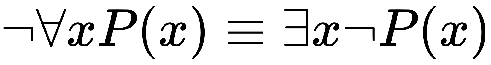

# Note #3: Removed Thoughts

Thoughts edited from the work the author does not yet want to consign to oblivion, until he is certain that what is contained within them is nonsense.

## 1. Frege Considerations

TODO

In other words, Nothing is `a priori` to Being; Being is `contingent` on Nothing[^20]. In order for this to be the case, negation must also be `a priori` to Being, for as **Frege** has shown, Nothing is captured through the negation of form.

This is obvious in the realm of formal logic, where objects or objectified propositions are the operands of negation, conjunction or disjunction, over which existence is asserted via quantification. As an example, consider the formal proposition, "_for all a greater than zero, there exists an x such that x^2 + a = 0_" versus "_for all a greater than zero, there does not exist an x such that x^2 + a = 0_"; in both cases the form of the denoted content, i.e. the square of a number plus one equals zero, is identical, but the concept which solves the equation depends on the quantifier applied, i.e. how many exist. In the first case, the concept thus asserted is that of complex numbers, whereas in the second, the concept asserted is that of real numbers.

TODO

In all of this, we have said nothing of the Being of the concepts in this metaphysics. All we have shown is given their existence, how the contingency of Being arises through form, but is itself not the form, for we find ourselves in the world with the form. Existence is a property that emerges through the metaphysics of assertion and negation[^21]. The Being of the existent is beyond the realm of metaphysics, and is properly understood as subject matter for ontology. 

In other words, the form of Being, its representations of the world, tells Being nothing at all about what it means to be except that to be is not to be found in form thus expressed,perceived  but among these forms, otherwise it would not encounter that form in its Being. And if we ask what it is that separates us (in the mode of Being) from ourselves (in the mode of Being form), the only possbility is Nothing. This what **Jean-Paul Sartre** meant when he said, "_Presence to self, on the contrary, supposes that an impalpable fissure has slipped into being. If being is present to itself, it is because it is not wholly itself. Presence is an immediate deterioration of coincidence, for it supposes separation. But if we ask ourselves at this point 'what it is' which separates the subject from himself, we are forced to admit it is 'Nothing'."[^22]

**Frege** has another stunning insight to stack on top of all of this talk of Nothing and negation, and its apparent `a priori` nature. We shall first state his result using modern symbolism and then provide a commentary on its meaning,

TODO: 

Thus, Nothing, negation and existence are the metaphysical foundation of Being, the `a priori`s of ontology. This is what we mean when say, in the sequel, that "_Being is not identical to existence_".

**Heidegger**'s failing was not realizing our ontological nature, our way of Being in the world, has an inherently metaphysical dimension. We find ourselves being in the world, with an inherent interpretation of that Being as a Being in the world. We have assumed a metaphysical posture by Being here, not there; this, not that. Our very Being is a metaphysical assertion that this is the way it is and not some other way. It is by Being and through Being that metaphysics become physics, if by physics we understand what is actual rather the inquiry of physics

**Alfred Whitehead**'s insight into this matter can be found in _Process and Reality_: "_Whenever we attempt to express the matter of immediate experience, we find that its understanding leads us beyond itself, to its contemporaries, to its past, to its future, and to the universals in terms of which its definiteness is exhibited. But such universals, by their very character of universality, embody the potentiality of other facts with variant types of definiteness. Thus the understanding of the immediate brute fact requires its metaphysical interpretation as an item in the world with some systematic relation to it_"[^23]

This interpretation of which Whitehead speaks is implicitly metaphysical, because interpretation is with respect to the Being interpretting, which requires a world against which to interpret. But every interpretation is necessarily focused on its object inquiry, which can never be Being in its generality, but a Being in its particularity, and therefore fails to encompass the totality of Being. The Being of physics, for instance, will never coincide with the Being of the objects of its inquiry. In other words, "_If we consider any scheme of philosophic categories as one complex assertion, and apply to it the logician's alternative, true or false, the answer must be that the scheme is false_"[^24] because Being will always separate the inquiry from the inquired; or, "_the fallacy consists in neglecting the degree of abstraction involved when an actual entity is considered merely so far as it exemplies certain categories of thought_"[^25].

TODO: sartre origin of negation reference here

TODO: heidegger what is metaphysics reference here

With a nod to **Platonic** forms and as a harbinger of what is to come, we propose the decomposition of **Frege**'s insights into the following metaphysical laws,

- Existence of form is an eternal relation in space.
- Being of form is a transitory relation in time.

We see in these laws why **Heidegger** came to understand time as the horizon over which Being is, rather than space. Space gives rise to form, but time gives rise to change, and a thing only becomes in relation to change. The Being of a form in time is a degeneration of the existence of the form in space[^26]. A Being becomes so that it be and in so doing, exposes itself to the possibility of perishablity. Its own Nothingness precedes the Being of form. 

We also note that, since Being is always in time, we must necessarily append another law to approach metaphysical completeness, i.e. we must have a law that explains what happens _after_ what is becomes what was.

- Nothing belongs to the existence of form after it is no longer in time. 

[^21]: We should say, properly, "_through the metaphysics of assertion and logic_", but we only wish to bring into relief at the current moment in time the contingency of Being on negation.
[^22]: [Being and Nothingness, Chapter 1: Immediate Structure of the For-Itself, Section I: Presence to Self, Jean-Paul Sartre, 1958](https://archive.org/details/beingnothingness0000unse)
[^23]: [Process and Reality, Chapter 1, Section VI, Alfred Whitehead, 1978](https://archive.org/details/processrealitygi00alfr)
[^24]: [Process and Reality, Chapter 1, Section V, Alfred Whitehead, 1978](https://archive.org/details/processrealitygi00alfr)
[^25]: [Process and Reality, Chapter 1, Section III, Alfred Whitehead, 1978](https://archive.org/details/processrealitygi00alfr)
[^26]: Do not be mislead by the notion of _space_ used here. This is not the _space_ of distance, but the _space_ of relation, where a thing exists through the logical necessity of its form. The relation "_is equal to_" applies not only to distances, but just as well to abstract concepts, as seen in the phrase "_speed of the car is equal to the angle of the speedometer multiplied by a constant_". Relations operate on domains of concepts, and it of this space made of the totality of relational domains that we now speak.

## 2. Definition of Ontology

_Ontology_, if we simply define it by its root words, is the study of Being. It takes as its subject matter the _meaning_ of Being. In short, ontology asks a single question: What does it mean _to be_? This is by no means a simple question, even though we answer it every day simply by not being dead. That we _are_ means we must, to some extent, possess the answer to this question, but it is not at all clear how we should put that answer into words. By even asking the question we assume the posture of interpretting our Being as a Being inquiring into the meaning of its Being. This recursion is an inherent feature of inquiry; we approach the subject matter of inquiry with a presupposition about what it means to be. "_Every scientific memoir in its records of the 'facts' is shot through and through with interpretation_". [^11]

The meaning of _Being_ is transfused with our everyday intuition, with our immediate apprehension of the world outside ourselves. We use _Being_ in a variety of contexts: The rock _is_ heavy, the mountain _is_ high, love _is_ delightful, red _is_ pretty, the idea _was_ disgusting, I _am_ hesitant, you _are_ reading, he _was_ sick, the teacher _was_ doubtful, and so on, ad infinitum. It would seem, then, _Being_ must be a broad concept to encompass so wide an array of possibilities. How are we to preserve its meaning across its diverse usage? To put another way, _am_ I the same way a rock _is_?

Often, _Being_ is colloquially equated with that of _existence_, but this is not quite right. The error results from a misunderstanding of semantics, as seen in the contrived syntax, "_The rock is_". Here we are led along the path of a syntactically correct sentence to a semantic meaning that does not adequately express reality, i.e. the rock _is_, without reference to anything else, as if Being were something that did not require a ground to draw it into repose. 

Among the greatest of **Martin Heidegger**'s many insights is his realization the relation of Being contains within it an implicit reference to the world in which to the thing/entity/being is. For this reason, he introduced the term, `Being-in-the-world`, as a way of drawing the reader's attention towards the implicit ontological relations contained in our concept of Being. The _world_ in this neologism is not the world of space and time, although that is one aspect of it, but a world of everything that exists, including the possibility of that existence.

_Being_ is a relation. This relation implicitly contains the world and the entity that relates to the world. It is the way in which an existent entity is in the world. 
 

Our Being, and the Being of all other entities, is recursive in this sense: It contains an implicit reference to itself. We are, in so far, that we can be in relation to ourselves. The rock is the rock, I am I, you are you. Do not conclude these propositions are nonsense, haphazard permutations of syntax. Instead, they should be perceived for what they are: tautological trivialities, a form of ontological identity. fR

**Heidegger** conceptualized a type of Being called `Dasein`, in order to distinguish it from the types of being possessed by things like plants, rocks, numbers or concepts. Our Being is such that it is concerned with its Being. Our Being is with respect to the forms it apprehends, an apprehension of forms that necessarily contains within it the form that is apprehending.

**Heidegger** acknowledges the split between ontology and metaphysics, rightly giving priority, as its relates it us and our experience of ourselves, to ontology over metaphysics. Nevertheless, in supposing a characteristic separation between the properties of our Being and the properties of the Being of things, he tacitly assumes a metaphysical theorem _about_ Being in the construction of his ontology, namely that the Being of some entities, such as rocks and asteroids, are not concerned with their Being. This seems a likely hypothesis, and one cannot fault **Heidegger** for its assumption if he were conducting himself in his everyday routines, but when doing philosophy, we must be explicit in acknowledging our priors.

The hypothesis is alluring, for it appears self-evident. It would seem to be the case our Being is distinct from other Beings of a certain species or genre. It is apparent that we, as humans, have unique properties that distinguish us from, say, a park bench. Appearances, however, are no foundation for an ontological philosophy. So that is all it can remain: a hypothesis. It is a prior assumption we bring to the table over and above the ontic priors we implicitly bring with us into our apprehensions, the very priors we are trying to discern in the construction of any ontology. 

If we build a top of a mixture 

How are we to separate the consequences of our assumptions, the consequences of our priors, and the variations with respect to one another? If the ontological pursuit is understood as the removal of `factical` priors from our understanding of Being, then we must not allow ourselves to be fooled into thinking there is a basis for the differentiation of Being into partitions. Heidegger means as much when he talks about the "unity" of Being.

Death is a proposition about form: that it will cease be. 

[^11]: [Process and Reality, Chapter 1, Section VI, Alfred Whitehead, 1929](https://archive.org/details/processrealitygi00alfr)